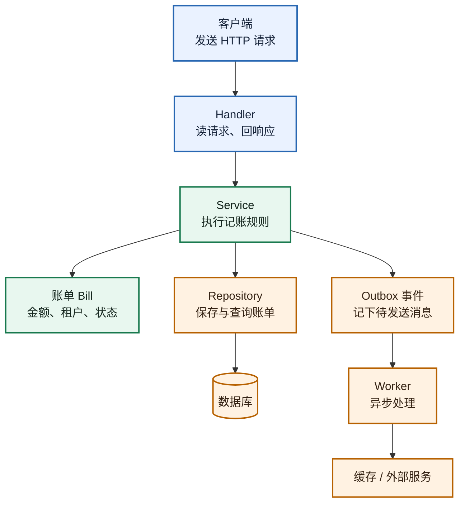

# 后端领域图

请求怎样从 HTTP 边界进入记账领域，再落到存储和异步处理。

```mermaid
flowchart TB
    client["客户端<br/>发送 HTTP 请求"] --> handler["Handler<br/>读请求、回响应"]
    handler --> service["Service<br/>执行记账规则"]
    service --> bill["账单 Bill<br/>金额、租户、状态"]
    service --> repository["Repository<br/>保存与查询账单"]
    repository --> database[("数据库")]
    service --> outbox["Outbox 事件<br/>记下待发送消息"]
    outbox --> worker["Worker<br/>异步处理"]
    worker --> cache["缓存 / 外部服务"]

    classDef edge fill:#EAF2FF,stroke:#2867B2,color:#17243A,stroke-width:2px;
    classDef domain fill:#E8F7EF,stroke:#18794E,color:#14251D,stroke-width:2px;
    classDef infra fill:#FFF2E2,stroke:#B76100,color:#352314,stroke-width:2px;
    class client,handler edge;
    class service,bill domain;
    class repository,database,outbox,worker,cache infra;
```
