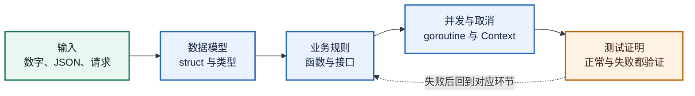

# Go 学习主线

从输入开始，通过数据模型、业务规则、并发控制，最后用测试证明结果。

```mermaid
flowchart LR
    input["输入<br/>数字、JSON、请求"] --> model["数据模型<br/>struct 与类型"]
    model --> rule["业务规则<br/>函数与接口"]
    rule --> concurrent["并发与取消<br/>goroutine 与 Context"]
    concurrent --> proof["测试证明<br/>正常与失败都验证"]
    proof -. "失败后回到对应环节" .-> rule

    classDef start fill:#E8F7EF,stroke:#18794E,color:#14251D,stroke-width:2px;
    classDef middle fill:#EAF2FF,stroke:#2867B2,color:#17243A,stroke-width:2px;
    classDef finish fill:#FFF2E2,stroke:#B76100,color:#352314,stroke-width:2px;
    class input start;
    class model,rule,concurrent middle;
    class proof finish;
```
